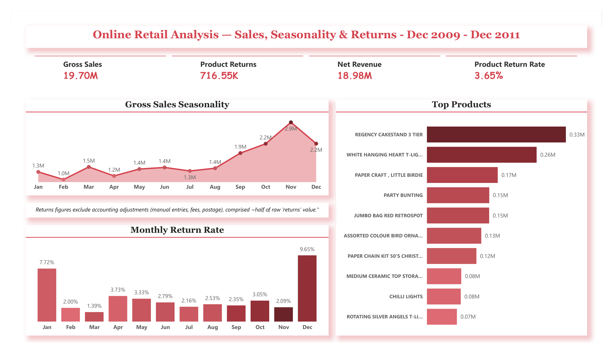

# Online Retail — Sales, Seasonality & Returns Analysis

An end-to-end analysis of ~1 million real transactions from a UK online gift
retailer (Dec 2009 – Dec 2011), covering data cleaning, SQL analysis, Python
visualization, and a Power BI dashboard — with a focus on **seasonality** and a
distinctive **returns** investigation.

> **Data:** the public *Online Retail II* dataset (UCI Machine Learning
> Repository), real transaction data from a UK-based online retailer, used here
> for portfolio purposes.

This is my fourth project in a portfolio spanning two domains — finance
([SACCO SQL](https://github.com/MWACHI-SIMON/tujenge-sacco-sql-analysis),
[default prediction](https://github.com/MWACHI-SIMON/tujenge-sacco-default-prediction),
[dashboard](https://github.com/MWACHI-SIMON/tujenge-sacco-executive-dashboard))
and now **retail**.

---

## Dashboard

## The headline: the obvious returns figure is roughly double the truth

A naive analysis of this data shows returns eroding **~7% of revenue**. That
number is wrong — and correcting it is the core of this project.

Investigating the "returns" revealed that **over half of the recorded returns
value (~£746K of £1.46M) was not merchandise returns at all** — it was
accounting adjustments: manual corrections, Amazon fees, bank charges, and
postage reversals booked as negative-quantity lines. Once these are separated
out, **genuine product returns total ~£717K — a true product-return rate of
~3.6%**, roughly half the naive figure.

Most published analyses of this dataset delete the negative rows in step one and
never see any of this. This project treats them as the material.

## Key findings

**1. The sales peak is November, not December.** Revenue climbs Sep→Nov and peaks
in November, then steps down in December. This fits the business (a gift retailer
selling largely to wholesalers, who stock up *ahead* of the Christmas consumer
season). Sept–Dec carries the year.

**2. Returns concentrate in Dec–Jan at 3–5× the baseline.** The genuine
product-return rate runs ~1.4–3.7% most of the year but spikes to **9.7% in
December and 7.7% in January** — the post-Christmas returns wave. Notably,
November (the sales peak) has one of the *lowest* return rates (~2%): the
wholesale surge is clean, planned buying.

**3. Revenue ≠ volume at the product level.** The top revenue product (Regency
Cakestand) isn't the top seller by units (White Hanging Heart) — a higher-priced
item vs. a high-volume cheaper one.

**4. Data-quality catches.** Two "products" (Paper Craft Little Birdie, Medium
Ceramic Storage Jar) were sold and returned in near-identical quantities,
behaving like bulk booking corrections rather than normal retail — flagged for
investigation rather than treated as ordinary sales.

## Method

**Cleaning (Python / pandas):** removed 34K exact duplicates; excluded zero/
negative price errors; derived a `Revenue` line total; split transactions into
Sales and Returns via quantity sign; and — crucially — separated genuine product
returns from accounting adjustments. Different cleaning decisions were applied
per analysis (e.g. rows with missing Customer IDs were kept for product analysis,
where a customer isn't needed).

**ETL:** ~1.03M cleaned rows loaded into MySQL in chunks via SQLAlchemy.

**SQL:** top products, monthly revenue, seasonality, and the returns breakdown.

**Python:** seasonality and return-rate visualizations (matplotlib), including a
before/after comparison showing the naive vs. corrected returns pattern.

**Power BI:** an executive dashboard with DAX measures that encode the exclusion
logic, so every figure reconciles across SQL, Python, and Power BI.

## Skills demonstrated

- Cleaning and validating a large, messy, real-world dataset (~1M rows)
- Building a chunked **ETL pipeline** (CSV → pandas → MySQL)
- SQL analysis: aggregation, date functions, conditional aggregation, `NOT IN`
  filtering
- Python visualization and honest before/after comparison
- Power BI: DAX measures with embedded business rules, month sorting, executive
  design
- **Analytical skepticism** — interrogating an obvious headline and correcting it

## Files

| File | Purpose |
|---|---|
| `dashboard.png` | The Power BI dashboard |
| `Retail_Analysis_Dashboard.pbix` | The Power BI file |
| `retail_cleaning_and_analysis.ipynb` | Cleaning, ETL, and Python analysis |
| `retail_analysis.sql` | The SQL analysis queries |
| `findings.md` | Plain-language summary |
